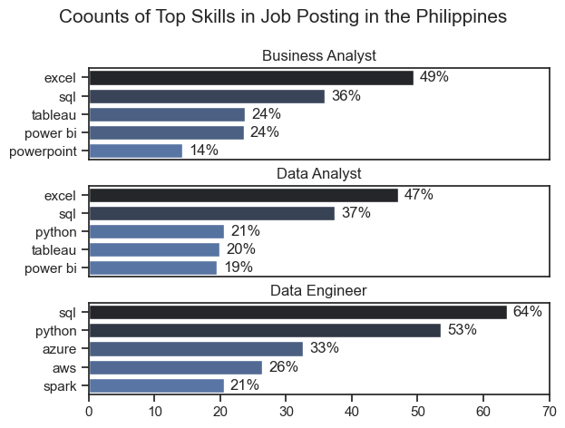

# The Analysis 

## 1. What are the most demanded skills for the top 3 most popular data roles in Philippines? 

To find the the most demanded skills for the top 3 most popular data roles, I created this visualization using Python and visualizing it with the help of Seaborn and matplotlib. 

### Results 

 

## Insights 

## The Data Industry in the Philippines Is Still Analyst-Heavy

The dominance of Excel and SQL suggests that many companies still operate at a traditional or intermediate analytics maturity level, where dashboards and reporting are the core responsibilities.

## 1. Universal Skills: Excel & SQL

### Across Business Analyst and Data Analyst roles, and still relevant for Data Engineers:

Excel remains a dominant skill in analyst roles

- Business Analyst: 49%
- Data Analyst: 47%

SQL is critical across all data-focused roles

Business Analyst: 36%

- Data Analyst: 37%
- Data Engineer: 64% (highest among all roles)

This shows that companies consistently value candidates who can handle data extraction, cleaning, and reporting.

## 2. Data Visualization Tools: Tableau & Power BI

### More relevant for analyst roles, especially Business & Data Analysts:

Business Analyst:

- Tableau: 24%
- Power BI: 24%

Data Analyst:

- Tableau: 20%
- Power BI: 19%

Visualization tools are in demand but secondary to Excel/SQL. Analysts must communicate insights effectively, and these tools help create dashboards and reports.

## 3. Programming Skills: Python

### More common for Data Analysts and Data Engineers:

- Data Analyst: 21%
- Data Engineer: 53%

Python is the bridge between analysis and engineering. Data Analysts use it for automation and advanced analytics, while Data Engineers rely on it for pipelines, ETL, and backend data work. 

## 4. Cloud Skills: Azure, AWS

Highly relevant for Data Engineers:

- Azure: 33%
- AWS: 26%

Cloud technologies are increasingly essential for data infrastructure and modern data engineering workflows.